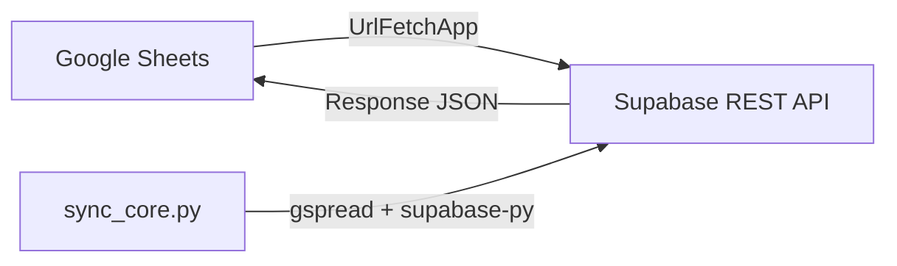

# Arquitectura: Google Sheets ↔ Supabase

> **Sistema de Gestión RRHH - Administración Low-Code**

## Decisiones de Diseño (ADR)

| ID | Decisión | Justificación |
|----|----------|---------------|
| ADR-001 | GAS usa `PropertiesService` | Nunca exponer API Keys en código |
| ADR-002 | Separar `Code.gs` y `config.gs` | Single Responsibility Principle |
| ADR-003 | Conservar `sync_core.py` | Complementa validación DAMA |

---

## Flujo de Datos



---

## Tablas Sincronizadas

| Tabla | Unique Key | Campos Obligatorios |
|-------|------------|---------------------|
| `datos_personales` | `dni` | nombre, apellido, dni, cohorte |
| `planificacion` | `id_dia`, `id_turno` | fecha, tipo_turno, cant_residentes_plan |
| `convocatoria` | `id_plani`, `id_agente` | fecha, tipo_turno, agente |
| `turnos` | `tipo_turno` | tipo_turno, cant_horas_default |
| `dias` | `fecha` | fecha, es_feriado |
| `saldos` | `id_agente`, `mes`, `anio` | id_agente, mes, anio |

---

## Seguridad

> [!CAUTION]
> **Nunca hardcodear credenciales en archivos `.gs`**

### Configuración de API Keys

```javascript
// En Google Apps Script:
// Archivo → Propiedades del proyecto → Propiedades de script
//   SUPABASE_URL = https://xxx.supabase.co
//   SUPABASE_SERVICE_KEY = eyJh... (service_role, NO anon)
```

### Cuándo usar cada Key

| Key | Uso | RLS |
|-----|-----|-----|
| `anon` | Lecturas públicas | ✅ Aplica |
| `service_role` | Escrituras admin | ❌ Bypass |

---

## Estructura de Archivos

```
admin_tools/
├── DESIGN.md           # Este archivo
├── gas_scripts/
│   ├── Code.gs         # Funciones principales
│   └── config.gs       # Configuración de tablas
└── config/
    └── (reservado para exports)
```

---

## Memoria del Agente

Decisiones tomadas en esta sesión:

- **2026-01-26**: Frontend Next.js movido a `/legacy_frontend_v1`
- **2026-01-26**: Estructura GAS creada con separación de responsabilidades
- **Esquema SQL activo**: `schema_v3_DAMA_compliant.sql`
- **Config de tablas**: `config_tables.json` (6 tablas)
