# Módulo de Ingeniería de Datos & Calidad (ETL)

> Sistema automatizado ETL (Extract, Transform, Load) para migrar registros históricos desde fuentes no estructuradas hacia una arquitectura de base de datos relacional moderna.

## 🎯 El Desafío

Existía un conjunto de datos históricos gestionados manualmente en archivos planos (Spreadsheets) con inconsistencias típicas de la entrada humana:

| Problema | Descripción |
|----------|-------------|
| **Duplicidad de Entidades** | Recursos registrados múltiples veces con variaciones |
| **Redundancia de Transacciones** | Eventos duplicados por errores de copiado/pegado |
| **Datos Sucios** | Fechas fuera de rango, formatos no normalizados |
| **Falta de Relaciones** | Datos planos sin vínculos relacionales claros |

## 💡 La Solución

Pipeline ETL en Python que aplica reglas de negocio para "sanitizar" la información antes de persistirla.

### Arquitectura

```
etl/
├── README.md              # Este archivo
├── config/
│   └── sources.yaml       # Configuración de archivos fuente
├── src/
│   ├── __init__.py
│   ├── extractor.py       # Carga de datos crudos
│   ├── transformer.py     # Reglas de negocio y limpieza
│   └── loader.py          # Generación de SQL/JSON
├── scripts/
│   └── run_migration.py   # Entry point
├── tests/
│   └── test_transformer.py
└── output/
    └── (archivos SQL generados)
```

### Flujo de Procesamiento

```mermaid
graph LR
    A[📥 Excel Legacy] --> B[🧹 Extractor]
    B --> C[⚙️ Transformer]
    C --> D[💾 Loader]
    D --> E[📄 SQL Idempotente]
    E --> F[🗄️ PostgreSQL]
```



## 🔧 Técnicas Aplicadas

### 1. Ingesta y Normalización (Extraction)
- Lectura de múltiples hojas Excel con `pandas`
- Normalización de campos temporales (corrección de años erróneos)
- Detección dinámica de columnas de entidades

### 2. Reglas de Unicidad (Transformation)
- **Deduplicación de Eventos**: SET-based para unicidad `O(1)`
- **Conciliación de Logs**: Cruce de registros de actividad vs excepciones
- **Resolución de Conflictos**: Si existe excepción, prevalece sobre actividad

### 3. Generación Idempotente (Loading)
- Cláusulas `WHERE NOT EXISTS` para inserciones seguras
- `ON CONFLICT DO NOTHING` para re-ejecución sin corrupción
- Transacciones con `BEGIN/COMMIT` para atomicidad

## 📊 Métricas de Calidad

| Indicador | Antes | Después |
|-----------|-------|---------|
| Duplicados de recursos | ~30% | 0% |
| Registros con fechas inválidas | 15% | 0% |
| Integridad referencial | ❌ | ✅ |
| Re-ejecutable sin errores | ❌ | ✅ |

## 🚀 Uso

```bash
# Configurar fuente de datos
vim config/sources.yaml

# Ejecutar migración
python scripts/run_migration.py

# Output generado en output/
cat output/migration_output.sql
```

## 📜 Licencia

Parte del proyecto [gestion-rrhh-centro](https://github.com/pmolinofabrica/gestion-rrhh-centro).
